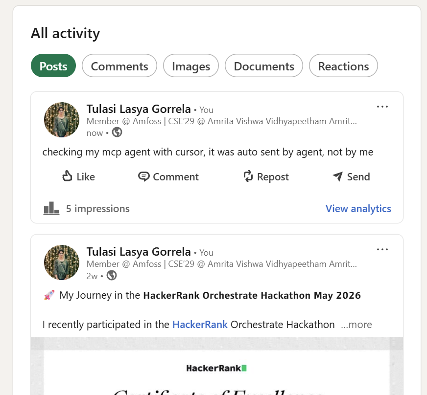

# MCP AI Agents — Real-world Automation Suite

A collection of 4 real-world AI agents built using **Model Context Protocol (MCP)** — a protocol that allows AI models to connect with and control external tools, apps, and services. Each agent solves a real automation problem and was built and tested end-to-end.

> 🎓 Built as part of the **MCP Workshop: Build AI Automations That Work For You** by NxtWave, conducted by MCP expert and IIT Guwahati alumnus Mr. Revanth Konakanchi.

---

## What is MCP (Model Context Protocol)?

MCP is a standard protocol that allows AI agents to interact with external applications — think of it as a universal connector between an AI model and the real world. Instead of manually switching between apps, an MCP-enabled agent can:

- Read and write to external platforms (LinkedIn, Gmail, etc.)
- Call external APIs and process responses
- Chain multiple actions together in a single workflow
- Operate autonomously without human clicks

**How it works in practice:**
```
User Prompt → MCP Host (Cursor) → MCP Integration Layer (Composio) → External Platform (LinkedIn / Gmail)
                                                                    ↕
                                                             LLM (Gemini API)
```

---

## Agents Built

### 1. 🔗 LinkedIn Content Agent
**Tools:** Cursor (MCP Host), Composio  
**What it does:** Takes a text prompt as input, connects to LinkedIn via MCP through Composio, and autonomously drafts and publishes a post — without any manual login or clicking.

**How it works:**
1. User gives a content prompt to the agent
2. Cursor acts as the MCP host, routing the request
3. Composio handles the LinkedIn MCP connection
4. Agent drafts the post using the LLM and publishes it directly

**Use case:** Automating content workflows and professional posting  
**Proof:** This agent was used to publish a real LinkedIn post autonomously

📸 **Output:**


---

### 2. 📧 Email Automation Agent
**Tools:** Cursor (MCP Host), Composio  
**What it does:** Takes user-provided details (recipient, subject, intent) and automatically structures and sends a professional email — no manual drafting needed.

**How it works:**
1. User provides recipient details and the purpose of the email
2. LLM structures the email content professionally
3. Composio connects to Gmail via MCP
4. Email is sent automatically

**Use case:** Automating professional outreach, follow-ups, internship applications

📸 **Output:**


---

### 3. 🔊 Voice Calling Agent
**Tools:** ElevenLabs, Twilio  
**What it does:** Converts a text prompt into natural-sounding human speech using ElevenLabs, then places a real phone call to a specified number via Twilio's API. The recipient picks up and hears the AI voice in real time.

**How it works:**
1. Text input is passed to ElevenLabs API → converted to natural speech audio
2. Twilio API places a real outbound phone call
3. When the call is answered, the AI voice plays
4. Real-time voice interaction is possible

**Use case:** AI-based calling assistants, automated reminders, voice notifications

> 📞 **Tested live** — received and answered a real phone call from this agent.

🎬 **Demo Recording:**
[Watch voice agent demo](Outputs/voice-agent-recording.mp4)

---

### 4. 🚂 Indian Railways Live Agent
**Tools:** Indian Railways API, MCP  
**What it does:** Takes a train number as input and fetches real-time live train status — current location, delay status, arrival times — directly from the Indian Railways API.

**How it works:**
1. User inputs a train number
2. Agent queries the Indian Railways API via MCP
3. Live data is fetched and returned in a readable format

**Use case:** Instant travel information through a conversational AI interface

📸 **Output:**


---

## Tools & Technologies

| Tool | Role | What it does |
|---|---|---|
| **Cursor** | MCP Host | Orchestrates all agent actions and routes requests |
| **Composio** | MCP Integration Layer | Connects agents to 100+ external platforms including LinkedIn and Gmail |
| **ElevenLabs** | Voice AI | Converts text into natural, human-like speech |
| **Twilio** | Communication API | Places real outbound phone calls programmatically |
| **Indian Railways API** | Data Source | Provides real-time train status and travel data |
| **Gemini API** | LLM | Powers agent reasoning, content generation, and decision making |

---

## Setup Guide

> ⚠️ This project uses external APIs and MCP integrations. You will need your own API keys and connected accounts for each service.

### Prerequisites
- [Cursor IDE](https://cursor.sh) installed
- [Composio](https://composio.dev) account with LinkedIn and Gmail connected
- [ElevenLabs](https://elevenlabs.io) account and API key
- [Twilio](https://twilio.com) account, SID, and auth token
- [Gemini API](https://aistudio.google.com) key
- Indian Railways API key

### Configuration
Copy the example config and fill in your own keys:
```bash
cp config.example.json config.json
```

Fill in `config.json`:
```json
{
  "gemini_api_key": "YOUR_GEMINI_API_KEY",
  "composio_api_key": "YOUR_COMPOSIO_API_KEY",
  "elevenlabs_api_key": "YOUR_ELEVENLABS_API_KEY",
  "twilio_account_sid": "YOUR_TWILIO_SID",
  "twilio_auth_token": "YOUR_TWILIO_AUTH_TOKEN",
  "railways_api_key": "YOUR_RAILWAYS_API_KEY"
}
```

### MCP Configuration in Cursor
1. Open Cursor Settings → MCP
2. Add Composio as an MCP server
3. Connect your LinkedIn and Gmail accounts on the Composio dashboard
4. Verify the connection by running a test prompt

> 📌 Note: Composio's MCP setup steps may evolve over time. Always refer to the latest [Composio Docs](https://docs.composio.dev) for current integration instructions.

---

## Key Learnings

- How Model Context Protocol (MCP) works as a standard for connecting AI to external tools
- Connecting multiple services (LLM + APIs + platforms) into a single automated workflow
- How voice AI pipelines work end to end (text → speech → phone call)
- Real-world debugging — handling API errors, connection issues, and output formatting
- Moving from learning a concept → actually building and testing it

---

## Project Structure

```
mcp-ai-agents/
├── outputs/
│   ├── linkedin-agent-output.png
│   ├── email-agent-output.png
│   ├── voice-agent-recording.mp4
│   └── railways-agent-output.png
├── config.example.json
├── .gitignore
└── README.md
```

---

## Author

**Gorrela Tulasi Lasya**  
First-year B.Tech CSE, Amrita Vishwa Vidyapeetham  
Member, amFOSS Open Source Club

[](https://www.linkedin.com/in/tulasi-lasya-gorrela-ba954536a/)
[](https://github.com/TulasiLasya)
[](https://tulasilasya.github.io/TulasiLasyaPortfolio.github.io/)
